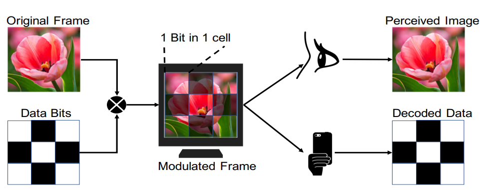
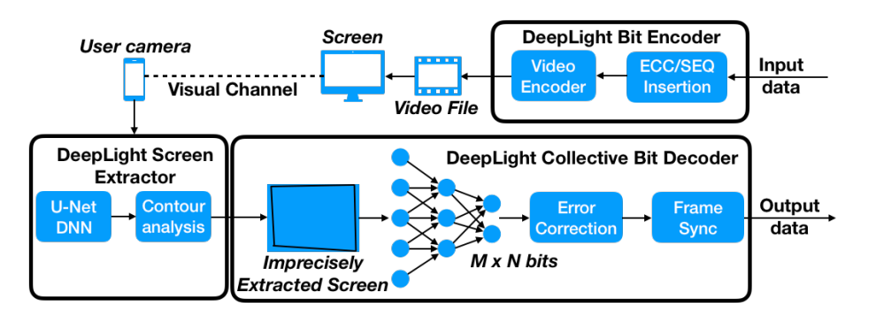

# Deeplight : Robust & Unobtrusive Real-time Screen-Camera Communication for Real-World Displays

This repository is the authors' implementation of the following paper.

Vu Tran, Gihan Jayatilaka, Ashwin Ashok and Archan Misra, 2021, April. *Deeplight : Robust & Unobtrusive Real-time Screen-Camera Communication for Real-World Displays*. In 2021 20th ACM/IEEE International Conference on Information Processing in Sensor Networks (IPSN) (). IEEE.

## Overview diagram


## System architecture


DeepLight's objective is to enable Screen-Camera Communication in real-world conditions where the camera is hand-held, and the modulation must be imperceptible at COMMON display rates (30-60FPS). Under these conditions, the state-of-the-art is susceptible to screen extraction error (losing part of the screen or including the content close to the screen) as the decoder explicitly split the extracted screen into a grid. Consequently, a slight deviation from the original grid may result in a large percentage of a cell being translated into neighboring cells and vice versa. In addition, the state-of-the-art relies on high frame rates (>=120FPS) to suppress the flickers created by the modulation, which is less common in public spaces. DeepLight is robust against screen extraction error as it does not explicitly split the extracted screen into a grid. Instead, it decodes each bit using the information of the entire screen via a convolutional neural network. Thank to the holistic decoding approach, DeepLight is sufficiently robust to support high decoding accuracy even with a hand-held camera (with hand-motion artifacts). Of course, DeepLight still needs to localize and extract the screen from camera frames with reasonably high accuracy. DeepLight applies a deep-learning-based, pixel-wise segmentation method to localize the screen. It then uses a RANSAC-like algorithm with contour analysis to detect the border of the screen with a practically high IOU of 89% in indoor environments. Finally, DeepLight achieves a significantly higher Mean Opinion Score (MOS) compared with the state-of-the-art by selectively encoding the data in only the Blue channel (primate eyes are known to be less sensitive to Blue color due to lower number of receptors). 

In this project, we implement DeepLight in both offline (using python) and real-time (using Objective-C for iPhone) modes. For the offline mode, we use Keras and Tensorflow to implement the neural network. For the real-time mode, we port the code into Objective-C and C++. We use the CoreML framework to execute the neural networks and use the OpenCV framework for typical image processing tasks.

## Dataset:

If you want to train the networks, please download the following datasets, including (1) fixedfull1010.npz, (2) handfull1010.npz for LightNet, and (3) scrdetfull.npz for ScreenNet.

https://drive.google.com/drive/folders/1vz-zp5GM9gRHa7fxr6o8LQ3HQJeUW2Kv?usp=sharing

LightNet: 

$ dataset = np.load("fixedfull1010.npz")

$ data = dataset['X'] #22500 3-blue-frame stacks with arbitrary, artificial screen extraction errors; size = 299x299; 25200 frames for handfull1010.npz

$ bits = dataset['Y'] #22500 10x10 array of corresponding bit values

ScreenNet:

$ dataset = np.load("fixedfull1010.npz")

$ data = dataset['X'] #256x256 color frames

$ corners = dataset['Y'] #8-element arrays: [lefttop_x, lefttop_y, righttop_x, righttop_y, rightbottom_x, rightbottom_y, leftbottom_x, leftbottom_y]


## Code structure

### OFFLINE MODE: stable/python

Requirements: OpenCV, Numpy, Scipy, Keras, Tensorflow

Download the weights files for LightNet and ScreenNet at the following URL, and put the files in "weights" folder (if not exist, create one in "python" folder):

https://drive.google.com/drive/folders/1pkz3prKmwAsPRFtsS6NHyeCVZXAQV4c2?usp=sharing

Download the test files at the following URL, and put the files in "test" folder (if not exist, create one in "python" folder):

https://drive.google.com/drive/folders/1kmif3tUZfqG5S2NNanDKHsHADN__pjS1?usp=sharing

The hand_realtime.avi was recorded from the buffer in the real-time IOS App, so it contains only around 100 frames, and thus better to be tested on OLDeepLight app. Run the following command to decode the video:

$ python deeplight.py -v test/fixed_alice.avi -ltn weights/LightNet.h5 -scn weights/ScreenNet.json -t 16 -d log -o 1 -n -1

papameters:

-v: input video

-ltn: weight file for LightNet

-scn: weight file for ScreenNet

-t: screen detection interval (run ScreenNet intermittently)

-d: log file name

-o: output type: 1 - print decoded text; 0 - record binary data in log.txt. The extracted screens are always recorded in log.avi

-n: number of frame to run (provide -1 to run all frames in the input video). 


### Generating, playing and recording DeepLight videos

Requirements: OpenCV, Numpy, OpenGL (for OpenGL video player), libxnvctrl-dev (for G-Sync)

If you want to record new videos, you can use one of our pre-encoded (Alice in Wonder Land) from the following URL:

https://drive.google.com/drive/folders/1BaJcClkGICoeKe7susaYlq2nGreIpUiD?usp=sharing

Or create new one using genDeepLight.py (the output should be .AVI to avoid inter-frame compression). The generator can be found at (utils/VideoGen).

$ python genDeepLight.py alice.npy original.mp4 test.avi 500

Please use a G-Sync monitor and an Nvidia GPU to display videos, using a G-Sync capable video player, to avoid screen tearing effect. We developed a simple OpenGL video player that support G-Sync and play videos at fixed display rate. Set the display rate at a fixed value of 60FPS when using our OpenGL player. The software can be found at "utils/mem2screen" (run the software and press SPACE to start)

$ make

$ ./mem2screen video_name start_frame_index

To record a video for post-processing, make sure the video is recorded with MJPG encoder at 120FPS (do NOT use compression, or at least use the highest quality factor. Do not use inter-frame compression format such as MP4 as it mixes consecutive frames and damage our subtle Manchester encoding). We developed a Recorder App for IOS that can record high quality video with MJPG encoder. The App can be found at "utils/Recorder". To record:

(1) Press "AF" button to fix the focus

(2) Press "AE" to fix the exposure time and white balancing

(3) Press RECORD button to start recording

(4) Copy the video file Record.mov and the timestamp file Record.ts to you computer using the File Sharing function in MacOX (Finder App)


### REAL-TIME & OFFLINE MOBILE MODE: stable/ios (Tested on iPhone 11 Pro and iPhone 12)

Requirements: To use the IOS App, you need Xcode and a developer account (a free account is enough).

Download the OpenCV framework at the following URL, and place it in the project folder (in the same folder with main.m):

https://drive.google.com/drive/folders/1LoKapJA-MJjv4472Una_8N0QwI5HmTph?usp=sharing

Download the weight files (in CoreML) format for LightNet and ScreenNet at the following URL, and put them in "Models" folder in the Xcode project (if not exist, create one in the project folder -- same level with main.m):

https://drive.google.com/drive/folders/1W1UFW-pOHX1KfN7ZTjEzCdCzvLP2vx34?usp=sharing

A. To run the code in an iPhone using a pre-recorded video (OFFLINE MOBLE MODE), download the test videos at the following URL, and drag the file to the OLDeepLight App (on the iPhone) using the file sharing Tab in Finder (on MacOS):

https://drive.google.com/drive/folders/1kmif3tUZfqG5S2NNanDKHsHADN__pjS1?usp=sharing

Remember to rename the file to hand.mov before copying it to the IOS App. Otherwise, please change the expected filename in the file ViewController.m in the OLDeepLight project.

Press "Next" button to run 100 frames and displays the decoded text in the debug terminal. It also prints out the total processing time of each component in the system.

The other buttons are used to start and stop the continuous running mode to measure power consumption only.


B. To run DeepLight in REAL-TIME mode, first you need a G-Sync monitor and an Nvidia GPU to avoid screen tearing effect (if screen tearing occurs, frames may be skipped or mixed, which will, of course, damage the manchester encoding scheme in the video)

Download the following pre-encoded video (Alice in Wonderland), and use a G-Sync capable video player to play the video (we used own own OpenGL player but it cannot play long videos):

https://drive.google.com/drive/folders/1BaJcClkGICoeKe7susaYlq2nGreIpUiD?usp=sharing

(1) Start the iOS App RTDeepLight and wait about 15 seconds for it to initialize buffers. 

(2) Seat yourself on a chair. 

(3) Press "AF" button to fixed the focus. 

(4) Press "GO" button to start the process. 

(5) Now whenever you press the RECORD button (the Round one), it will process the previous 32 frames and show the result on the screen. The screen corners will be updaed as well. Note that the result is the text from 32 frames right after the previous session, not the current frames. You can feel how fast it process the data.


# Cite

You may cite this work as per the following bibitex.
```
@InProceedings{Tran2021IPSN,
author = {Tran, Vu and Jayatilaka, Gihan and Ashok, Ashwin and Misra, Archan},
title = {Deeplight : Robust & Unobtrusive Real-time Screen-Camera Communication for Real-World Displays},
booktitle = {ACM/IEEE International Conference on Information Processing in Sensor Networks (IPSN)},
month = {May},
year = {2021}
}
```